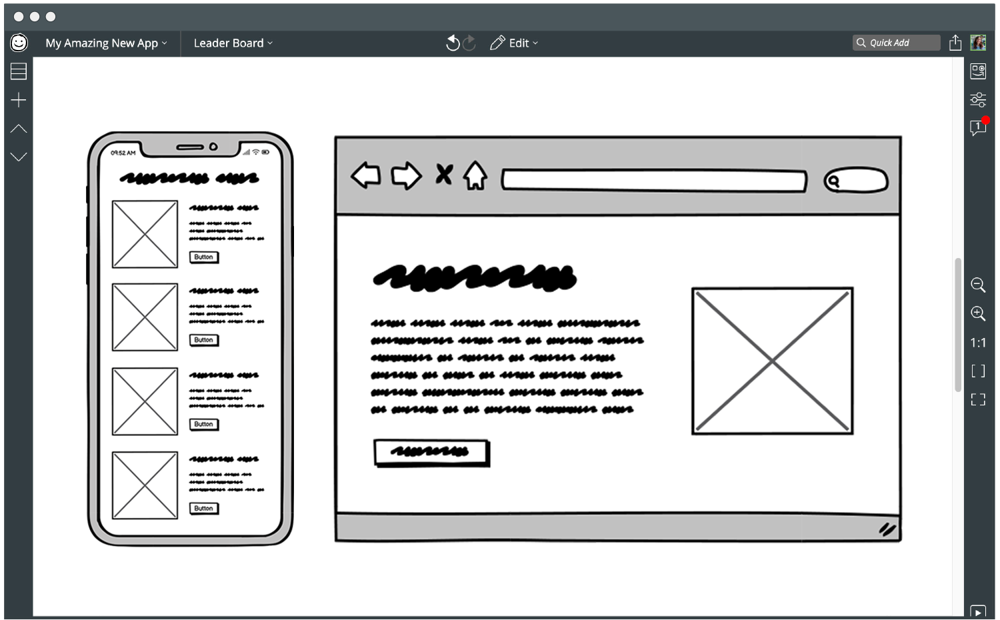
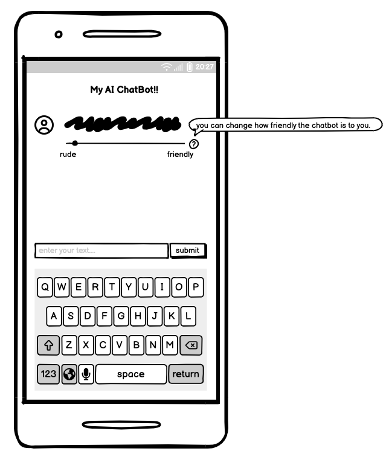

# Balsamiq

**URL**: https://balsamiq.com/

A great computer wireframing tool to build out ideas. You can build low-fideliy, medium-fidelity, and high-fidelity wireframes.

**Video**: https://www.youtube.com/watch?v=I2N7Vl6IOVc

Although balsamiq isn't a free software, you can get a 30-days free trial of Balsamiq Cloud.

After creating an account, you can log in and start creating wireframes.

We wil go through a brief tutorial and create a UI wireframe that looks like this:

